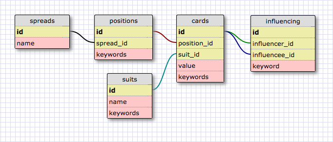

# Active Record Tarot

## Problem Space

The problem space is a tarot spread. I chose this because there are tons of different relationships in a tarot spread -- between the positions and the cards, the cards and their suits, the cards and one another, etc.

## User Stories

* For each spread, I want to be able to see all the positions and which cards appear in which position.
* For each card in this spread, I want to be able to see all the cards in the spread with which it has a relationship.
* I want to be able to list all of the keywords of all of the cards in the spread at once, to get an overall sense of the spread.
* I want to be able to number how many of each suit there are in the spread, and how many major arcana.
* For each position, I want to be able to see the keywords for the position next to the keywords for its cards.

## Schema design

